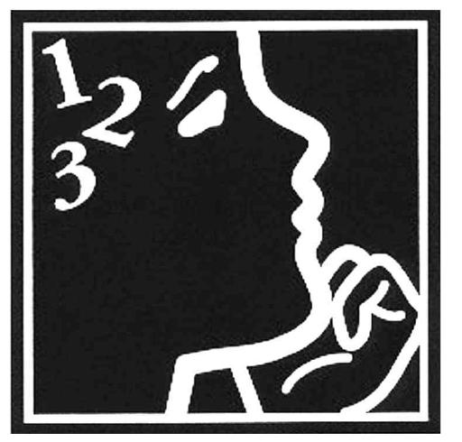

# _Know your knowing!_    

> Persevering in task through to completion; remaining focused. Looking for ways to reach your goal when stuck. Not giving up.

—_Habits of Mind 5_

> When the mind is thinking it is talking to itself.

—_Plato_

## M04 Objectives

**Session 4.1**

*   Create a pie chart
*   Format chart elements
*   Create a line chart
*   Work with chart legends
*   Create a combination chart

**Session 4.2**

*   Create a scatter chart
*   Edit a chart data source
*   Create a data callout
*   Insert shapes and icons into a worksheet
*   Create and edit a data bar
*   Create and edit a group of sparklines
