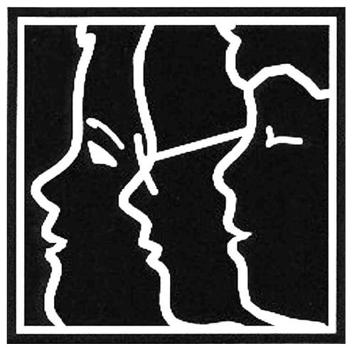

# _Work together!_ 

> Being able to work in and learn from others in reciprocal situations. Team work.

—_Habits of Mind 15_

> Take care of each other. Share your energies with the group. No one must feel alone, cut off, for that is when you do not make it.

—_Willie Unsoeld, mountain climber_

## M12 Objectives
**Session 12.1**
*   Create a WordArt graphic
*   Plot data with a funnel chart
*   Hide error values with the IFERROR function

**Session 12.2**
*   Validate data entry
*   Hide worksheet rows and columns
*   Hide worksheets
*   Protect worksheets and workbooks from edits
*   Unlock worksheets cells to allow edits

**Session 12.3**
*   Display the Developer tab
*   Record and run a macro
*   Assign a macro to graphic or macro button
*   Edit macro code in an editor
