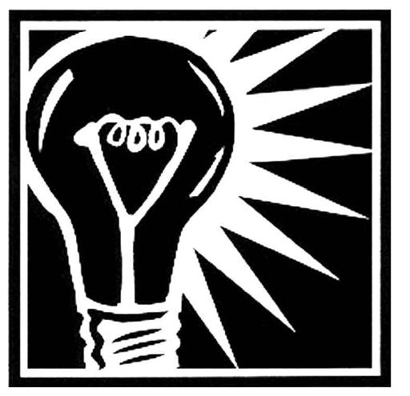

# _Try a different way!_ 

> Generating new and novel ideas, fluency, originality.

—_Habits of Mind 11_

> The future is not some place we are going to but one we are creating. The paths are not to be found, but made, and the activity of making them changes both the maker and the destination.

—_John Schaar, political scientist_

## T02 Objectives
- Measure your mastery of learning objectives across the modules **five through eight**.
- Note: Module 9 through 12 are NOT part of the exam!

## Final is due by next Monday! 
It takes approximately 50-75 minutes to complete. (Plan 2 hours)
Be sure to work on your exam before the due date! Late Submissions will not be accepted!

Best of luck everyone!
Phil
