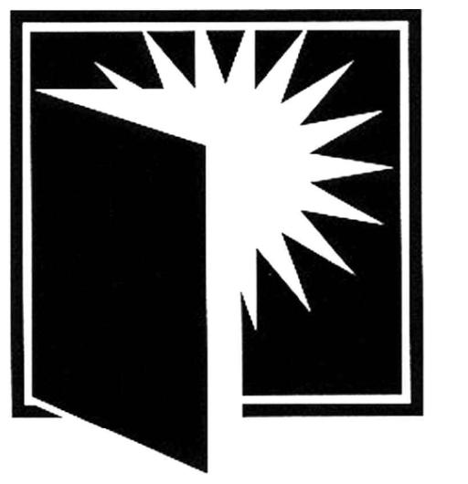

# _Learn from experience!_ 

> Having humility and pride when admitting we don't know; resisting complacency.

—_Habits of Mind 16_

> The greater our knowledge increases the more our ignorance unfolds.

—_John F. Kennedy_

## T03 Objectives
**Exam 3**

**Capstone Project 3**
